<p align="center">
  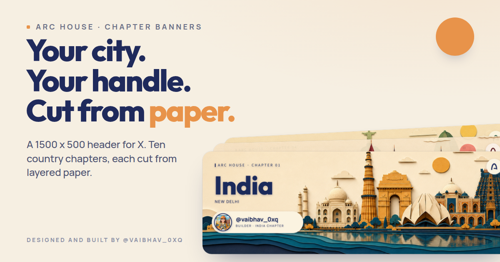
</p>

<h1 align="center">Arc House chapter banners</h1>

<p align="center">
  A banner studio for Arc House members. Pick your country chapter, add your city, X handle and role, drop in a photo and download a personalised X header cut from layered paper.
</p>

<p align="center">
  <a href="LICENSE">MIT licence</a> ·
  <a href="#getting-started">Getting started</a> ·
  <a href="#api">API</a> ·
  <a href="https://x.com/vaibhav_0xq">Built by Vaibhav</a>
</p>

---

## What you get

- A 1500 x 500 PNG, the exact size X uses for profile headers.
- A 3000 x 1000 WebP for retina screens and anywhere else you want the banner sharp.
- A live preview that matches the download. The browser and the server draw from the same geometry and the same font files.
- Privacy by design. Nothing is stored. The photo travels once to the renderer and the finished files come straight back to the browser.

<p align="center">
  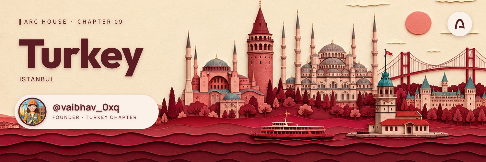
</p>

## Chapters

Every chapter has its own base artwork, ink colour, pill paper and swatch. Picking a chapter re-tints the whole page.

| | | |
|:--|:--|:--|
| 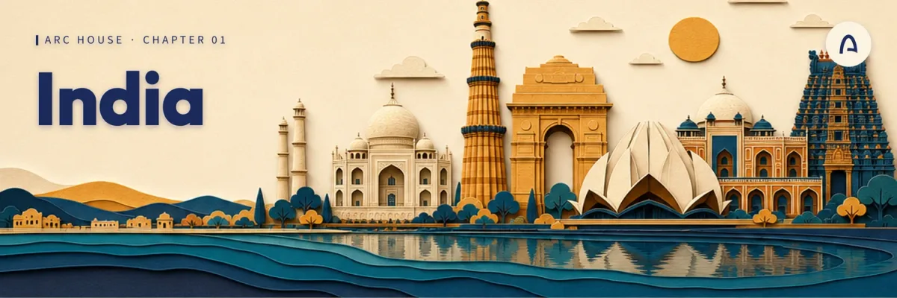<br>**01 India** · South Asia | 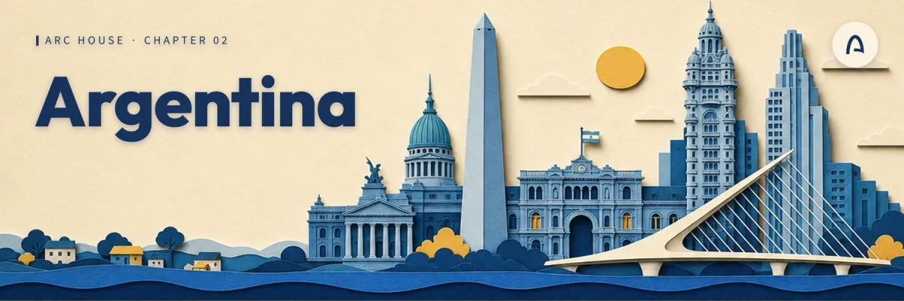<br>**02 Argentina** · South America | 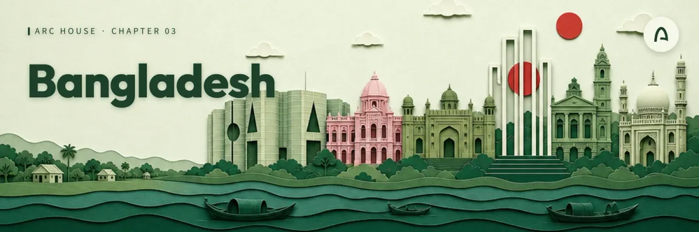<br>**03 Bangladesh** · South Asia |
| 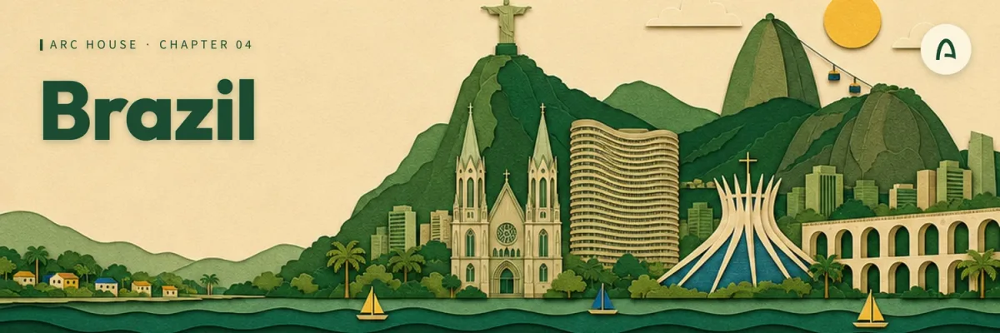<br>**04 Brazil** · South America | 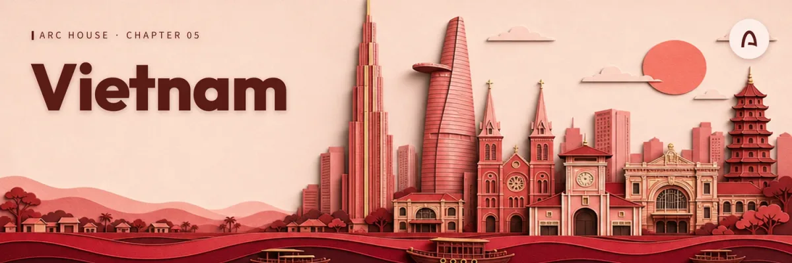<br>**05 Vietnam** · Southeast Asia | 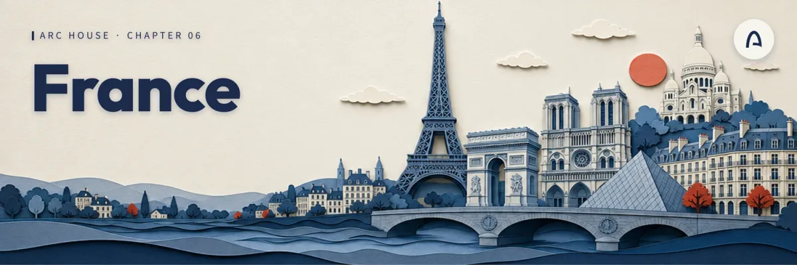<br>**06 France** · Europe |
| 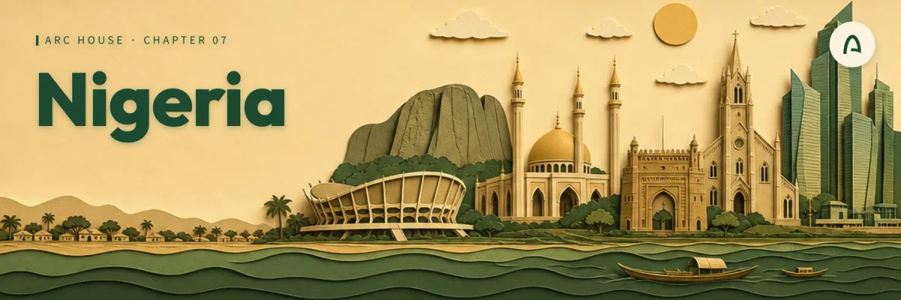<br>**07 Nigeria** · West Africa | 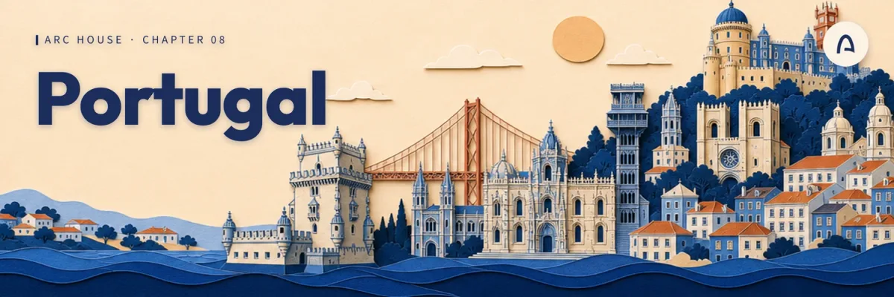<br>**08 Portugal** · Southern Europe | 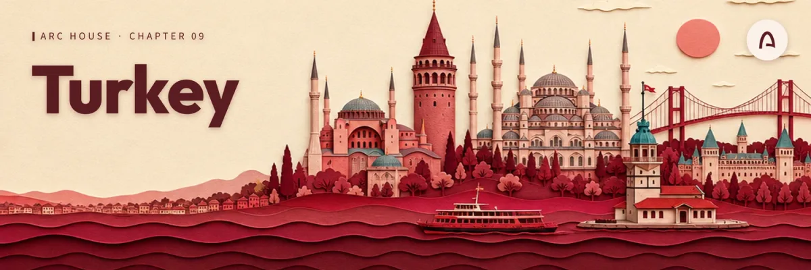<br>**09 Turkey** · West Asia |
| 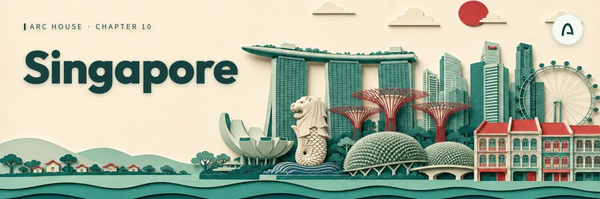<br>**10 Singapore** · Southeast Asia | | |

## Ready-made files

Not everyone wants to run the studio. A shared Drive folder holds every chapter as a blank banner (no pill) at 1500 x 500, 3000 x 1000 and 6000 x 2000, plus personalised examples at the same sizes: [Arc banners on Google Drive](https://drive.google.com/drive/folders/183-BVc7GH3nDJuPOZ1bH2LTsu-QC6Owf).

| Zip | Contents |
|:--|:--|
| `papercut-blank-1500x500.zip` | Ten blank banners at the X header size |
| `papercut-blank-3000x1000.zip` | Ten blank banners at 2x |
| `papercut-blank-6000x2000-part1-01to05.zip` and `part2-06to10.zip` | Ten blank banners at 4x, split in two |
| `papercut-personalised-1500-3000.zip` | Personalised examples at 1500 x 500 and 3000 x 1000 |
| `papercut-personalised-6000-part1-01to05.zip` and `part2-06to10.zip` | Personalised examples at 6000 x 2000 |

## How it works

1. The browser draws a live SVG preview over the chapter artwork: the chapter title, your city, the handle pill with the role line and your photo in the ring.
2. When you download, the browser sends your inputs and the cropped photo (as a data URL, never written to disk) to `POST /api/banners/render`.
3. The server composes the same layout with `sharp` and `opentype.js` at 3000 x 1000, then downsamples with a Lanczos filter and a light sharpen to 1500 x 500 for the PNG.

The rules that both sides depend on (text validation, geometry, palette, crop maths) live in one shared package, so the preview and the render always start from the same numbers. The drawing code itself exists twice, once for the browser and once for the server. Any visual change has to be made in both places.

## Project structure

This is a pnpm workspace with two deployable services and a set of shared libraries.

```
artifacts/
  paper-chapters/     The studio. React 19, Vite, Tailwind, Zustand, React Query
  api-server/         Express API that renders the banners
lib/
  papercut-core/      Shared geometry, palette, text rules and crop maths
  banner-renderer/    Server side compositor (sharp + opentype.js) and its assets
  api-spec/           OpenAPI spec for the render endpoint and the codegen config
  api-zod/            Zod schemas generated from the spec
  api-client-react/   React Query hooks generated from the spec
docs/                 Images used in this README
```

## Getting started

You need Node 24 and pnpm 10.

```sh
pnpm install
pnpm run typecheck
```

Start the API server. It renders the banners and needs a port.

```sh
PORT=8080 pnpm --filter @workspace/api-server run dev
```

Start the studio in a second terminal. It needs a port and the base path it is served from.

```sh
PORT=5173 BASE_PATH=/ pnpm --filter @workspace/paper-chapters run dev
```

The studio calls the API at `/api` on its own origin. In development put a reverse proxy in front of the two servers or call `setBaseUrl` from `@workspace/api-client-react` with the API origin before the app mounts. On Vercel both run behind one domain, so nothing extra is needed.

### Environment variables

| Variable | Service | Purpose |
|:--|:--|:--|
| `PORT` | both | Port to listen on. Required. |
| `BASE_PATH` | studio | Path prefix the studio is served from, usually `/`. Required. |
| `SITE_URL` | studio | Public origin used to make the social preview image URL absolute at build time. |
| `BANNER_ASSETS_DIR` | API | Overrides where the renderer looks for its base artwork and fonts. |
| `LOG_LEVEL` | API | Pino log level. Defaults to `info`. |

### Useful scripts

| Command | What it does |
|:--|:--|
| `pnpm run typecheck` | Type checks every package |
| `pnpm run build` | Type checks, then builds every package |
| `pnpm --filter @workspace/api-spec run codegen` | Regenerates the Zod schemas and React Query hooks from `lib/api-spec/openapi.yaml` |

## Deploying to Vercel

The repo deploys to Vercel as one project: the studio as static files and the API as a function under `/api`. `vercel.json` holds the build command, the output directory, the function settings and the SPA rewrite. Import the repo, leave the root directory at the repo root, keep the framework preset on Other and deploy. No environment variables are needed. The social preview image URL is taken from `SITE_URL` when set. Otherwise it uses the production domain Vercel exposes at build time.

A few limits apply on Vercel: request and response bodies are capped at 4.5 MB (the studio shrinks photos before upload and the API refuses responses over 4.4 MB, so this holds) and the render function has 60 seconds per request.

## API

The studio talks to one endpoint.

### `POST /api/banners/render`

Request body (JSON):

| Field | Type | Notes |
|:--|:--|:--|
| `country` | string | Chapter slug: `india`, `argentina`, `bangladesh`, `brazil`, `vietnam`, `france`, `nigeria`, `portugal`, `turkey` or `singapore`. Required. |
| `city` | string | Up to 28 characters. Letters, digits, spaces and `. ' & / ( ) -`. Required. |
| `handle` | string | X handle with or without the `@`, 1 to 15 letters, digits or underscores. Required. |
| `role` | string | Up to 18 characters, same alphabet as the city. Omit for `Builder`. Send an empty string for no role line. |
| `pfpDataUrl` | string | Photo as a data URL (PNG, JPEG or WebP, up to 25 MB decoded). Omit to draw the neutral placeholder. |
| `scale` | number | Crop zoom from 1 to 4. Defaults to 1. |
| `offsetX`, `offsetY` | number | Pan from -1 to 1 as a fraction of the available slack. Default to 0. |

Response (JSON): `finalPngDataUrl` (1500 x 500 PNG), `masterDataUrl` (3000 x 1000 WebP) and their sizes in pixels and bytes.

Errors:

| Status | Meaning |
|:--|:--|
| `400` | Invalid input. The body names the field so the studio can point at the right control. |
| `413` | The photo or the request is too large. |
| `422` | A character the banner font cannot draw, again with the field name. |
| `429` | Too many renders from one client within a minute. |
| `503` | The renderer is saturated or the request waited too long for a slot. |

Rendering is guarded by an admission gate: two renders run at a time, six more may wait up to 20 seconds and each client gets 30 renders a minute. The request and response shapes are defined in `lib/api-spec/openapi.yaml`.

## Design notes

- Palette: paper `#F6EFE2`, sheet `#FBF6EA`, default ink `#1F2A5C`, saffron `#E8934A`. Each chapter brings its own ink and pill paper.
- Type: Outfit for display, Manrope for everything else. The banner text uses a self hosted Manrope build in both the browser and the renderer so measured widths agree to the pixel.
- The pill sits bottom left on purpose. That is where X overlays the profile avatar on the header, so the handle stays readable on the profile page.
- The pill widens to fit the longer of the handle line and the role line, never narrower than its minimum width.

## Licences

The code is released under the [MIT licence](LICENSE).

Manrope and Outfit are bundled as TTF files under `artifacts/paper-chapters/public/fonts` and `lib/banner-renderer/assets/fonts`. Both are released under the SIL Open Font License 1.1. The licence text and copyright notices sit next to the files in `OFL.txt`.

## Credits

Designed and built by [Vaibhav](https://x.com/vaibhav_0xq) for the Arc House community.
